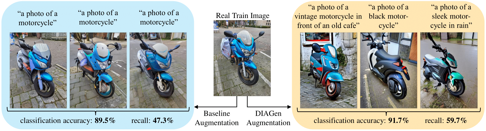
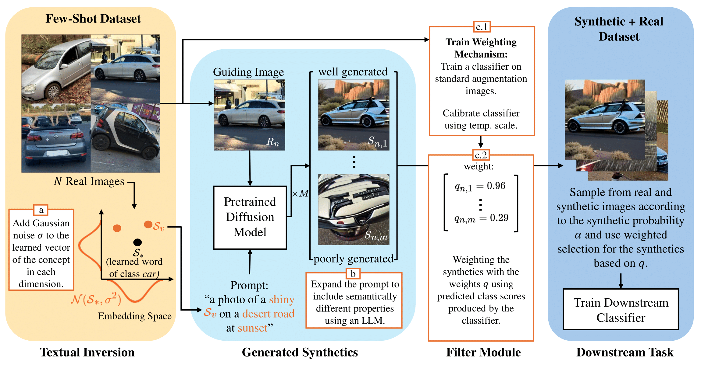

# DIAGen: Semantically Diverse Image Augmentation with Generative Models for Few-Shot Learning (GCPR 2024)



## Abstract
Simple data augmentation techniques, such as rotations and flips, are widely used to enhance the generalization power of computer vision models. However, these techniques often fail to modify high-level semantic attributes of a class. To address this limitation, researchers have explored generative augmentation methods like the recently proposed [DA-Fusion](https://github.com/brandontrabucco/da-fusion). Despite some progress, the variations are still largely limited to textural changes, thus falling short on aspects like varied viewpoints, environment, weather conditions, or even class-level semantic attributes (e.g., variations in a dog’s breed). To overcome this challenge, we propose DIAGen, building upon DA-Fusion. First, we apply Gaussian noise to the embeddings of an object learned with Textual Inversion to diversify generations using a pre-trained diffusion model’s knowledge. Second, we exploit the general knowledge of a text-to-text generative model to guide the image generation of the diffusion model with varied class-specific prompts. Finally, We introduce a weighting mechanism to mitigate the impact of poorly generated samples. Experimental results across various datasets show that DIAGen not only enhances semantic diversity but also improves the performance of subsequent classifiers. The advantages of DIAGen over standard augmentations and the DA-Fusion baseline are particularly pronounced with out-of-distribution samples.

## Installation

To set up DIAGen, clone the repository:
```bash
git clone git@github.com:visinf/DIAGen.git
cd DIAGen
```

Then set up the conda environment from the `environment.yml` file:
```bash
conda env create -f environment.yml
conda activate diagen
```

## Datasets
DIAGen is benchmarked on various few-shot image classification datasets, including MS COCO, FOCUS, and our Custom COCO dataset, which includes handmade images for 23 MS COCO classes.
Own datasets can be evaluated by implementing subclasses of `semantic_aug/few_shot_dataset.py`.

### 1. Setting Up Custom COCO
The Custom COCO dataset images are included in this repository and can be found [here](https://github.com/visinf/DIAGen/blob/main/semantic_aug/datasets/custom_coco/).

### 2. Setting Up FOCUS
An explanation on how to download the FOCUS dataset ([original repo](https://github.com/priyathamkat/focus.git)) can be found [here](https://umd.app.box.com/s/w7tvxer0wur7vtsoqcemfopgshn6zklv). After downloading and unzipping, execute our `semantic_aug/datasets/focus_create_split.py` to extract all the images into the needed directory structure and create a train, val and test split.

After that the FOCUS task is usable from `semantic_aug/datasets/focus.py`. Update the `FOCUS_DIR` variable located [here](https://github.com/visinf/DIAGen/blob/main/semantic_aug/datasets/focus.py#L19) to point to your local focus dataset directory.

### 3. Setting Up MS COCO

To set up MS COCO, first download the [2017 Training Images](http://images.cocodataset.org/zips/train2017.zip), the [2017 Validation Images](http://images.cocodataset.org/zips/val2017.zip), and the [2017 Train/Val Annotations](http://images.cocodataset.org/annotations/annotations_trainval2017.zip). These files should be unzipped into the following directory structure.

```
coco2017/
    train2017/
    val2017/
    annotations/
```
Update the `COCO_DIR` variable located [here](https://github.com/visinf/DIAGen/blob/main/semantic_aug/datasets/coco.py#L17) to point to your local coco2017 directory.

Note: Since MS COCO is not inherently designed for single-label classification, images are labeled according to the class of the largest object in the image.

## DIAGen Pipeline



The source code for the DIAGen pipeline is split into the following steps:

### 1. Textual Inversion (`fine_tune.py`)
In the first step, [Textual Inversion](https://arxiv.org/abs/2208.01618) is used to learn representations of all classes in the dataset as new pseudo words. To do this, `fine_tune.py` needs to be executed.

An example call could look like this:
```
python fine_tune.py --dataset="custom_coco" --output_dir=./ --pretrained_model_name_or_path="CompVis/stable-diffusion-v1-4" --resolution=512 --train_batch_size=4 --lr_warmup_steps=0 --gradient_accumulation_steps=1 --max_train_steps=1000 --learning_rate=5.0e-04 --scale_lr --lr_scheduler="constant" --mixed_precision=fp16 --revision=fp16 --gradient_checkpointing --only_save_embeds --flip_p 0.5 --seeds 0 --examples-per-class 2 --device 0       
```

### 2. Intermediate Processing (`aggregate_embeddings.py`)
Executing `aggregate_embeddings.py` will save all learned embeddings as a tokens.pt file. In this step we also introduce our first contribution <ins>(a) embedding noise</ins>, controlled by the parameters `--augment-embeddings` and `--std-deviation`.

An example call could look like this:
```
python aggregate_embeddings.py --seeds 0 --examples-per-class 2 --dataset "custom_coco" --augment-embeddings True
```

### 3. Generating Semantically Diverse Prompts (`generate_prompts.py`)
For our second contribution <ins>(b) class-specific prompts</ins>, the `generate_prompts.py` script needs to be executed. If you want to generate the text-prompts via the GPT 4 model, it is necessary to add an api key in a .env file [here in the project directory](https://github.com/visinf/DIAGen).

An example call could look like this:
```
python generate_prompts.py --dataset "custom_coco" --model "meta-llama/Llama-2-7b-chat-hf" --prompts-per-class 5 --out-filename "custom_coco_llama.csv"
```

### 4. Image Generation and Train Downstream Model (`train_classifier.py`)
The actual image generation process is combined with the training of the downstream classifier in `train_classifier.py`. Our third contribution <ins>(c) weighting mechanism</ins> for the synthetic images, can be controlled by the parameter `--synthetic_filter` which executes the code in `train_filter.py`.

An example call could look like this:
```
python train_classifier.py --dataset "custom_coco" --examples-per-class 2 --seed 0 --strength 0.7 --guidance-scale 15 --synthetic-probability 0.7 --use-embedding-noise 1 --use-generated-prompts 1 --prompt-path "prompts/custom_coco_llama.csv" --synthetic_filter "train" --method "DIAGen" --eval_on_test_set "test" --num-synthetic 10 --num-epochs 50 --iterations-per-epoch 200 --device 0
```

## Citation

If you find DIAGen helpful, please consider citing our work:

```
OUR CITATION
```

